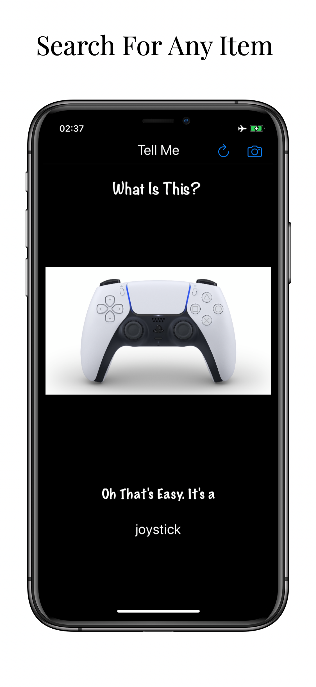

# Tell Me - CoreML

Using Machine Learning with CoreML, get answers to any information you need on what an item is. All data available offline

# Technologies used
- Xcode
- Swift
- CoreML
- Vision
- Storyboards and progmattic UI
- UIKit
- AutoLayout
- UIImagePickerController

# Screenshots

